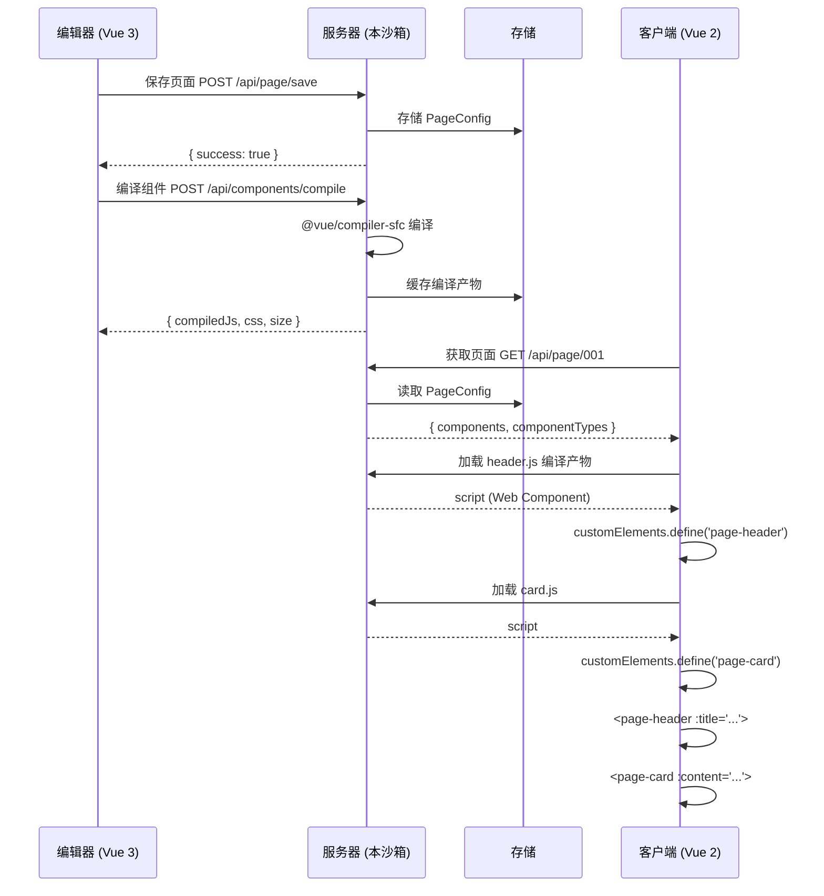
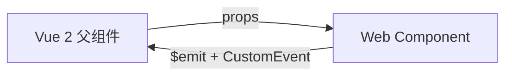

# Vibe Page Builder — 跨版本组件渲染方案

## 背景

```
编辑器（Vue 3 + Tailwind CSS 2.x）    客户端（Vue 2 + Tailwind CSS 2.x）
         │                                      │
         │  用户组装 15 个组件 → 保存页面配置       │
         │                                      │
         ▼                                      ▼
    本沙箱服务器存储配置                     需要渲染出完整页面
```

**核心矛盾**：编辑器用 Vue 3，客户端用 Vue 2，无法直接复用组件。
**解决思路**：服务器将每个组件编译为 Web Component（Custom Element），客户端通过 `<script>` 动态加载后原生渲染。

---

## 一、整体架构

```
┌─────────────────────────────────────────────────────────────┐
│                   服务器（本沙箱 Node.js）                      │
│                                                              │
│  ┌──────────────────┐   ┌─────────────────────────────┐      │
│  │ 编辑器 (Vue 3)   │   │ 编译服务                      │      │
│  │ 组装页面 → 保存   │──►│                              │      │
│  │ v-builder 页面    │   │ .vue SFC → .js Web Component  │      │
│  └──────────────────┘   └──────────┬──────────────────┘      │
│                                    │                         │
│  ┌──────────────────┐              │                         │
│  │ 页面配置 API      │              │                         │
│  │ /api/page/:id    │              │                         │
│  │ → JSON 配置      │              │                         │
│  └──────────────────┘              │                         │
└────────────────────────────────────┼─────────────────────────┘
                                     │
         HTTP 请求                   │
┌────────────────────────────────────┼─────────────────────────┐
│                   客户端（Vue 2）    │                         │
│                                     ▼                        │
│  ┌──────────────────────────────────────────────┐            │
│  │ 1. fetch(/api/page/xxx) → 拿到组件列表         │            │
│  │ 2. 提取去重 type → 动态加载 .js 文件            │            │
│  │ 3. <component :is="'page-xxx'" v-bind="props" │            │
│  │ 4. Web Component 渲染（框架无关）               │            │
│  └──────────────────────────────────────────────┘            │
└─────────────────────────────────────────────────────────────┘
```

---

## 二、组件编译服务（服务器端）

### 2.1 功能

接收 SFC 源代码，输出 Web Component 格式的 .js 文件。

### 2.2 接口

#### `POST /api/components/compile`

编译单个组件

```json
// Request
{
  "source": "<template>...<script>...</script>",
  "componentName": "header"
}

// Response
{
  "compiledJs": "customElements.define('page-header', ...)",
  "css": ".compiled-xxx { ... }",
  "size": 1234
}
```

#### `GET /api/components/:name.js`

直接获取编译好的 .js 文件（相当于静态资源）

```javascript
// /api/components/header.js
(function() {
  const style = document.createElement('style');
  style.textContent = `.compiled-header-xxx { ... }`;
  document.head.appendChild(style);

  const { defineCustomElement } = Vue;  // Vue 3 CDN 注入

  const Element = defineCustomElement({
    props: { title: String, ... },
    template: `<div class="...">{{ title }}</div>`,
    styles: [`.compiled-header-xxx { ... }`]
  });

  customElements.define('page-header', Element);
})();
```

### 2.3 编译流程

```
输入：xxx.vue SFC 字符串
  ↓
1. @vue/compiler-sfc.parse() 拆解 → template / script / style
  ↓
2. compileTemplate() 编译 template → render 函数
  ↓
3. compileScript() 处理 script setup → 组件选项
  ↓
4. 提取 <style> → 添加 scoped class 前缀
  ↓
5. 组装为 Web Component 格式
  ↓
输出：.js 文件（含 customElements.define）
```

### 2.4 缓存策略

```
编译过的组件按 (componentId + 版本号) 做文件缓存
  /public/compiled/header.v1.js
  /public/compiled/card.v2.js

命中缓存 → 直接返回
未命中   → 编译 → 写入缓存 → 返回
```

---

## 三、页面配置 API（服务器端）

### 3.1 数据结构

```typescript
// 页面配置（编辑器中保存的产物）
interface PageConfig {
  id: string
  name: string
  components: PageComponent[]
  createdAt: string
  updatedAt: string
}

interface PageComponent {
  instanceId: string     // 实例 ID，用于 v-for :key
  type: string           // 组件类型，如 "header", "card", "button"
  name: string           // 显示名
  props: Record<string, any>  // 传递给组件的 props
  order: number          // 排序
}
```

### 3.2 接口

#### `POST /api/page/save`

```json
// Request
{
  "id": "page_001",
  "name": "首页",
  "components": [
    { "instanceId": "inst_1", "type": "header", "name": "顶部导航", "props": { "title": "欢迎" }, "order": 1 },
    { "instanceId": "inst_2", "type": "card",   "name": "内容卡片", "props": { "content": "..." },  "order": 2 },
    { "instanceId": "inst_3", "type": "button", "name": "提交按钮", "props": { "text": "提交" },   "order": 3 }
  ]
}

// Response
{ "success": true, "id": "page_001" }
```

#### `GET /api/page/:id`

```json
// Response
{
  "id": "page_001",
  "name": "首页",
  "components": [ /* 同上 */ ],
  "componentTypes": ["header", "card", "button"]
}
```

> `componentTypes` 字段用于客户端快速判断需要加载哪些 .js 文件

---

## 四、客户端集成方案（Vue 2 项目）

### 4.1 安装方式

在 Vue 2 项目的 `index.html` 中引入 Vue 3 CDN（Web Component 渲染用，与 Vue 2 共存）：

```html
<!-- Vue 2 主框架 -->
<script src="https://cdn.jsdelivr.net/npm/vue@2.7/dist/vue.min.js"></script>

<!-- Vue 3 运行时（仅用于 defineCustomElement，不冲突） -->
<script src="https://unpkg.com/vue@3/dist/vue.global.prod.js"></script>
```

### 4.2 主组件代码

```vue
<template>
  <div class="page-container">
    <!-- 页面加载中 -->
    <div v-if="loading" class="loading-spinner">加载中...</div>

    <!-- 组件列表渲染 -->
    <div v-for="comp in components" :key="comp.instanceId" class="mb-4">
      <component
        :is="'page-' + comp.type"
        v-bind="comp.props"
        @click="handleComponentEvent(comp.instanceId, $event)"
      />
    </div>

    <!-- 错误状态 -->
    <div v-if="error" class="error-state">{{ error }}</div>
  </div>
</template>

<script>
export default {
  name: 'PageRenderer',
  props: {
    pageId: { type: String, required: true }
  },
  data() {
    return {
      components: [],
      loading: true,
      error: null
    }
  },
  async created() {
    await this.loadPage()
  },
  methods: {
    async loadPage() {
      this.loading = true
      try {
        // 1. 获取页面配置
        const res = await fetch(`/api/page/${this.pageId}`)
        const page = await res.json()
        this.components = page.components

        // 2. 加载所有组件类型
        const loadedTypes = new Set()
        const loadTasks = page.componentTypes.map(async (type) => {
          if (customElements.get('page-' + type)) return  // 已加载跳过
          await this.loadComponent(type)
          loadedTypes.add(type)
        })

        await Promise.all(loadTasks)
      } catch (err) {
        this.error = '页面加载失败：' + err.message
      } finally {
        this.loading = false
      }
    },

    loadComponent(type) {
      return new Promise((resolve, reject) => {
        const script = document.createElement('script')
        script.src = `/api/components/${type}.js`
        script.onload = () => {
          // 等待 Web Component 注册
          let retries = 0
          const check = () => {
            if (customElements.get('page-' + type)) {
              resolve()
            } else if (retries++ < 20) {
              setTimeout(check, 50)
            } else {
              reject(new Error(`组件 ${type} 注册超时`))
            }
          }
          check()
        }
        script.onerror = () => reject(new Error(`组件 ${type} 加载失败`))
        document.head.appendChild(script)
      })
    },

    handleComponentEvent(instanceId, event) {
      console.log('[PageRenderer] 组件事件:', instanceId, event)
      // 可以在这里统一处理组件事件
    }
  }
}
</script>

<style scoped>
.page-container { min-height: 100vh; background: #F6F8FB; }
.loading-spinner { text-align: center; padding: 40px; color: #637089; }
.error-state { text-align: center; padding: 40px; color: #ef4444; }
.mb-4 { margin-bottom: 16px; }
</style>
```

---

## 五、Agent 团队任务分配

### Agent A：服务器编译服务

| 任务 | 说明 |
|------|------|
| 1. 创建 `POST /api/components/compile` | 接收 SFC 源码，编译为 Web Component |
| 2. 实现 `@vue/compiler-sfc` 编译管线 | parse → compileTemplate → compileScript → 组装 |
| 3. 实现 `GET /api/components/:name.js` | 静态资源输出 + 缓存 |
| 4. 组件版本管理 | 内容哈希 → 缓存键，组件更新后自动提升版本 |
| 5. 测试 | 编译 3 个不同类型组件的用例覆盖 |

### Agent B：页面配置 API

| 任务 | 说明 |
|------|------|
| 1. 设计 PageConfig 数据库表 | Supabase 或 本地 JSON 存储 |
| 2. 实现 `POST /api/page/save` | 保存页面 + 组件列表 |
| 3. 实现 `GET /api/page/:id` | 读取页面配置，含 `componentTypes` 去重 |
| 4. 实现 `GET /api/page/list` | 列出所有页面 |
| 5. 实现 `DELETE /api/page/:id` | 删除页面 |
| 6. 迁移现有编辑器保存逻辑 | 编辑器保存时调用 `POST /api/page/save` |

### Agent C：编辑器导出改造（Vue 3 沙箱）

| 任务 | 说明 |
|------|------|
| 1. 组件编辑器增加「编译并发布」按钮 | 调用 `/api/components/compile` |
| 2. 页面编辑器保存时同步调用页面 API | 编辑器保存 → `POST /api/page/save` |
| 3. 编译状态展示 | 展示每个组件的编译版本、编译时间、大小 |
| 4. 发布到生产 | 可选推送至 CDN 或静态资源目录 |

### Agent D：客户端 SDK（Vue 2 项目）

| 任务 | 说明 |
|------|------|
| 1. 创建 `<PageRenderer>` 组件 | 接收 pageId，渲染完整页面 |
| 2. 实现组件动态加载器 | `loadComponent(type)` 加载 .js + 等待注册 |
| 3. 实现组件缓存 + 去重 | 已加载的 Web Component 不重复加载 |
| 4. 错误处理 + 重试 | 加载失败重试 3 次，最终展示错误状态 |
| 5. 事件桥接 | 组件 emit 的事件冒泡到 Vue 2 父组件 |
| 6. Vue 2 + Vue 3 共存验证 | 验证两个 Vue 版本不冲突 |

---

## 六、数据流与接口契约总图



---

## 七、注意事项与边界情况

### 7.1 Vue 版本共存

- Vue 2 主应用用 CDN 或 npm 安装的 `vue@2.7`
- Vue 3 仅用于 `Vue.defineCustomElement`，通过 CDN 独立引入
- 两者互不干扰，各自挂在 `window.Vue` 和 `window.Vue3` 上

### 7.2 Tailwind CSS 隔离

- 每个 Web Component 编译时提取 `<style scoped>` 中的 Tailwind 样式
- 编译后的 CSS 注入到 Shadow DOM（`styles: [...]` 参数）
- 客户端侧 Tailwind 不会污染组件内部样式

### 7.3 组件通信



- 父 → 子：标准 HTML attribute / property（props）
- 子 → 父：CustomEvent 冒泡，Vue 2 用 `@click` / `@change` 等原生事件监听

### 7.4 性能优化

- **懒加载**：超出首屏的组件用 `IntersectionObserver` 延迟加载
- **组件缓存**：同一个 type 只加载一次
- **CDN 加速**：编译产物推送到 CDN，减少服务器压力
- **预加载**：HTML 中 `<link rel="preload">` 提示浏览器提前加载

### 7.5 错误处理

| 错误类型 | 处理方式 |
|---------|---------|
| 页面配置不存在 | 404 → 展示「页面不存在」 |
| 组件编译失败 | 编译接口返回 500 + 错误详情 |
| 组件 .js 加载失败 | 重试 3 次后展示「模块加载失败」占位 |
| 组件注册超时 | 5 秒超时后提示「组件不可用」 |
| props 类型不匹配 | Vue 3 内部 warning 不影响渲染 |

---

## 八、交付检查清单

### Agent A
- [ ] `POST /api/components/compile` 正常工作
- [ ] `GET /api/components/:name.js` 返回可执行 JS
- [ ] 缓存机制生效，同一个组件不重复编译
- [ ] 编译产物在浏览器中通过 `customElements.define` 注册

### Agent B
- [ ] 页面增删改查 API 完成
- [ ] 返回的 `componentTypes` 去重正确
- [ ] 数据持久化（Supabase / 文件系统）

### Agent C
- [ ] 编辑器保存时调用页面 API
- [ ] 组件编译状态可视化
- [ ] 页面列表支持预览链接生成

### Agent D
- [ ] `PageRenderer` 组件在 Vue 2 项目中正确渲染
- [ ] 动态加载器正确处理去重、缓存、重试
- [ ] 组件事件能冒泡到 Vue 2 父组件
- [ ] 页面加载失败有兜底 UI
- [ ] 内存泄漏测试：反复切换页面无残留 script