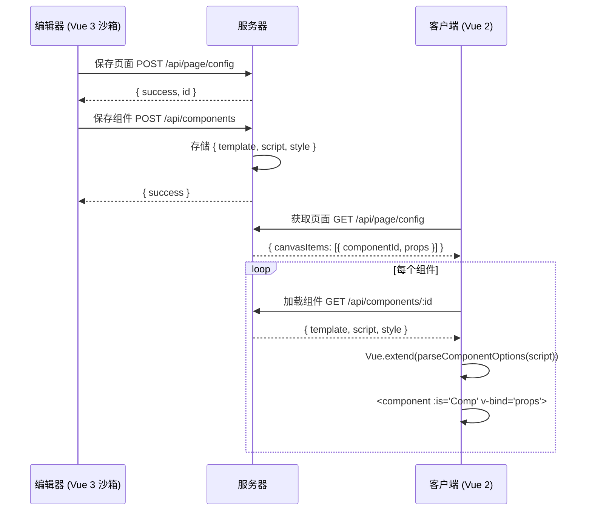

# Vibe Page Builder — 客户端渲染集成方案

> **版本说明**：编辑器产出是 **Vue 2 Options API** 组件代码，客户端也是 **Vue 2** 项目。  
> **无版本冲突**，无需 Web Component，无需 Vue 3，直接动态注册渲染。

---

## 一、核心事实

```
┌───────────────────────────────────────────────────────────┐
│                 编辑器（Vue 3 沙箱）                        │
│  用户在编辑器里写 Vue 2 组件 SFC → 拆解为                   │
│  { template, script, style } 存入后端                       │
└───────────────────────┬───────────────────────────────────┘
                        │ GET /api/page/config → 组件列表
                        │ GET /api/components/:id → 组件源码
                        ▼
┌───────────────────────────────────────────────────────────┐
│                 客户端（Vue 2 项目）                        │
│  拿到组件选项对象 → Vue.extend() 注册 → 渲染                │
│  <component :is="dynamicComp" v-bind="props" />            │
└───────────────────────────────────────────────────────────┘
```

**结论**：编辑器存的是「Vue 2 组件选项」，客户端读的是「Vue 2 组件选项」，同版本直接渲染，不需要任何中间转换。

---

## 二、整体架构

```
┌──────────────────────────────────────────────────────────────┐
│                        服务器                                 │
│                                                               │
│  存储服务                                                    │
│  ┌──────────────────────────────┐  ┌──────────────────────┐ │
│  │ 页面配置 API                  │  │ 组件文件 API          │ │
│  │ /api/page/config              │  │ /api/components/:id  │ │
│  │ → 返回组件列表 & 顺序          │  │ → 返回组件 Vue 2 源码 │ │
│  └──────────────────────────────┘  └──────────────────────┘ │
└─────────────────────────┬────────────────────────────────────┘
                          │
          HTTP 请求（Bearer token + X-Org-Id）
                          │
┌─────────────────────────┴────────────────────────────────────┐
│                    客户端（Vue 2 项目）                          │
│                                                                │
│  ┌────────────────────────────────────────────────────────┐  │
│  │                     PageRenderer                        │  │
│  │                                                        │  │
│  │  ① created → fetch(/api/page/config)                   │  │
│  │  ② 遍历 canvasItems → fetch(/api/components/:id)       │  │
│  │  ③ Vue.extend(compOptions) → 动态注册组件               │  │
│  │  ④ <component :is="Comp" v-bind="props" /> 渲染        │  │
│  └────────────────────────────────────────────────────────┘  │
└──────────────────────────────────────────────────────────────┘
```

---

## 三、关键数据结构

### 3.1 后端存储的结构

```typescript
// === 组件文件（编辑器保存的产物） ===
interface StoredComponent {
  id: string                    // 组件唯一 ID
  name: string                  // 组件名
  type: string                  // 类型标识，如 "loan-calculator"
  template: string              // <template>...</template>
  script: string                // export default { ... } 中的选项对象
  style: string                 // <style scoped>...</style>
  updatedAt: string
}
```

### 3.2 编辑器将 SFC 拆解存储

你在组件编辑器里写的是这样的 Vue 2 组件：

```vue
<template>
  <section class="theme3-calculator">
    <p>{{ $t('选择额度') }}</p>
    ...
  </section>
</template>

<script>
export default {
  name: 'Theme3LoanCalculator',
  data() { return { minAmount: 10000000, maxAmount: 100000000, ... } },
  computed: { ... },
  methods: { ... },
  mounted() { ... }
}
</script>
```

编辑器拆解后存为：

```json
{
  "id": "comp_loan_calc",
  "type": "loan-calculator",
  "name": "贷款计算器",
  "template": "<section class=\"theme3-calculator\">\n  <p>{{ $t('选择额度') }}</p>\n  ...\n</section>",
  "script": "{\n  name: 'Theme3LoanCalculator',\n  data() { return { minAmount: 10000000, ... } },\n  computed: { ... },\n  methods: { ... },\n  mounted() { ... }\n}",
  "style": ".theme3-calculator { padding: 20px; ... }"
}
```

> 注意：`script` 字段只需存 `export default { ... }` 花括号内的**选项对象内容**，客户端直接用 `new Function()` 解析。

---

## 四、接口定义

### 4.1 页面配置 API

#### `GET /api/page/config`

> ❗ 需要 `Authorization: Bearer {token}` + `X-Org-Id: {currentOrgId}`

```json
// Response
{
  "success": true,
  "data": {
    "id": "page_xxx",
    "canvasItems": [
      {
        "instanceId": "item_1",
        "componentId": "comp_loan_calc",
        "props": {},
        "order": 0
      },
      {
        "instanceId": "item_2",
        "componentId": "comp_header",
        "props": { "title": "欢迎" },
        "order": 1
      }
    ]
  }
}
```

#### `POST /api/page/config`

```json
// Request (编辑器保存时调)
{
  "canvasItems": [
    { "instanceId": "item_1", "componentId": "comp_loan_calc", "props": {}, "order": 0 },
    { "instanceId": "item_2", "componentId": "comp_header", "props": {}, "order": 1 }
  ]
}

// Response
{ "success": true, "data": { "id": "page_xxx" } }
```

### 4.2 组件文件 API

#### `GET /api/components/:componentId`

```json
// Response
{
  "success": true,
  "data": {
    "id": "comp_loan_calc",
    "type": "loan-calculator",
    "name": "贷款计算器",
    "template": "<section class=\"theme3-calculator\">\n  <p>{{ $t('选择额度') }}</p>\n  ...\n</section>",
    "script": "{\n  name: 'Theme3LoanCalculator',\n  data() { return { minAmount: 10000000, ... } },\n  computed: { ... },\n  methods: { ... },\n  mounted() { ... }\n}",
    "style": ".theme3-calculator { padding: 20px; ... }"
  }
}
```

---

## 五、客户端核心代码（Vue 2 项目）

### 5.1 PageRenderer.vue — 页面渲染器

```vue
<template>
  <div class="page-renderer">
    <!-- 加载中 -->
    <div v-if="loading" class="loading-state">{{ $t('加载中...') }}</div>

    <!-- 渲染组件列表 -->
    <component
      v-for="item in pageConfig.canvasItems"
      :key="item.instanceId"
      :is="getComponent(item.componentId)"
      v-bind="item.props || {}"
      @apply="handleEvent(item.instanceId, 'apply', $event)"
    />

    <!-- 错误状态 -->
    <div v-if="error" class="error-state">{{ error }}</div>
  </div>
</template>

<script>
/**
 * 缓存已注册的组件构造函数
 * key: componentId → Vue.extend 产物
 */
const componentCache = {}

/**
 * 根据 script 字符串生成 Vue 组件选项
 * script 格式：export default { ... } 或 {...}
 */
function parseComponentOptions(scriptStr) {
  // 去掉 export default 前缀
  const cleaned = scriptStr
    .replace(/^export\s+default\s+/, '')
    .replace(/;\s*$/, '')
  
  // 使用 Function 安全解析
  return (new Function('return (' + cleaned + ')'))()
}

export default {
  name: 'PageRenderer',
  props: {
    pageId: { type: String, required: true }
  },
  data() {
    return {
      pageConfig: { canvasItems: [] },
      loading: true,
      error: null
    }
  },
  async created() {
    await this.loadPage()
  },
  methods: {
    async loadPage() {
      this.loading = true
      this.error = null
      try {
        // 1. 获取页面配置
        const res = await fetch('/api/page/config', {
          headers: {
            'Authorization': 'Bearer ' + this.$root.token,
            'X-Org-Id': this.$root.currentOrgId
          }
        })
        const result = await res.json()
        this.pageConfig = result.data
      } catch (err) {
        this.error = '页面加载失败'
      } finally {
        this.loading = false
      }
    },

    /**
     * 获取或缓存组件的 Vue 构造函数
     */
    async getComponent(componentId) {
      // 命中缓存 → 直接返回
      if (componentCache[componentId]) {
        return componentCache[componentId]
      }

      // 未缓存 → 从后端加载
      try {
        const res = await fetch(`/api/components/${componentId}`, {
          headers: {
            'Authorization': 'Bearer ' + this.$root.token,
            'X-Org-Id': this.$root.currentOrgId
          }
        })
        const result = await res.json()
        const comp = result.data

        // 解析 script 字符串 → 组件选项
        const options = parseComponentOptions(comp.script)
        options.template = comp.template  // 注入 template

        // 添加 style 到 head（scoped 场景）
        if (comp.style) {
          const styleId = '_style_' + componentId
          if (!document.getElementById(styleId)) {
            const styleEl = document.createElement('style')
            styleEl.id = styleId
            styleEl.textContent = comp.style
            document.head.appendChild(styleEl)
          }
        }

        // 注册为 Vue 组件
        componentCache[componentId] = Vue.extend(options)
        return componentCache[componentId]

      } catch (err) {
        console.error('[PageRenderer] 组件加载失败:', componentId, err)
        return null  // 返回 null 则 v-if 跳过渲染
      }
    },

    handleEvent(instanceId, eventName, payload) {
      console.log(`[PageRenderer] 组件 ${instanceId} 触发 ${eventName}:`, payload)
      // 统一处理组件事件，如埋点/跳转等
    }
  }
}
</script>

<style scoped>
.page-renderer { min-height: 100vh; }
.loading-state { text-align: center; padding: 40px; color: #637089; }
.error-state { text-align: center; padding: 40px; color: #ef4444; }
</style>
```

### 5.2 在客户端项目中使用

```vue
<!-- 任意页面中 -->
<template>
  <div>
    <PageRenderer page-id="page_xxx" />
  </div>
</template>

<script>
import PageRenderer from './components/PageRenderer.vue'

export default {
  components: { PageRenderer }
}
</script>
```

---

## 六、处理特殊依赖

客户端的组件可能依赖以下全局功能，需要确保客户端项目已提供：

| 组件中使用的特性 | 客户端需要准备的 |
|----------------|----------------|
| `$t('xxx')` | Vue i18n 插件（`vue-i18n`） |
| `$root.$on('language-changed')` | 全局事件总线（`new Vue()` 上 emit） |
| `var(--color-primary)` | CSS 变量定义在 `:root` 中 |
| `this.$emit('apply', data)` | 父组件监听 `@apply` 事件 |
| `data-warden-*` 属性 | 埋点 SDK（可选，不影响渲染） |

---

## 七、Agent 团队任务分配

### Agent A：后端页面配置 API

| 任务 | 说明 |
|------|------|
| 1. 实现 `GET /api/page/config` | 读取当前页面配置 |
| 2. 实现 `POST /api/page/config` | 保存页面配置（编辑器调用） |
| 3. 实现鉴权 | `Authorization: Bearer token` + `X-Org-Id` |
| 4. 统一响应格式 | `{ success, data?, error? }` |

### Agent B：后端组件文件 API

| 任务 | 说明 |
|------|------|
| 1. 实现 `GET /api/components` | 组件列表 |
| 2. 实现 `GET /api/components/:id` | 返回组件 `template/script/style` |
| 3. 实现 `POST /api/components` | 编辑器保存/更新组件 |
| 4. 实现 `DELETE /api/components/:id` | 删除组件 |
| 5. 鉴权 + 统一响应 | 同上 |

### Agent C：客户端 PageRenderer 组件（Vue 2 项目）

| 任务 | 说明 |
|------|------|
| 1. 创建 `PageRenderer.vue` | 核心渲染组件（代码见第五章） |
| 2. 实现 `getComponent()` | 缓存 + 加载 + 解析组件选项 |
| 3. 实现 `parseComponentOptions()` | script 字符串 → Vue 选项对象 |
| 4. 处理 style 注入 | scoped/style 动态添加到 head |
| 5. 错误/加载/空状态 UI | 兜底展示 |
| 6. 对接客户端鉴权 | 从 `$root` 或 store 获取 token/orgId |
| 7. 事件冒泡 | 组件 emit 的事件冒泡到父组件 |

---

## 八、数据流总图



---

## 九、注意事项

### 9.1 Vue 版本确认

客户端**必须使用包含模板编译器的 Vue 2 构建**（即 `vue.esm.js` 或 `vue.js`，非 `vue.runtime.js`），因为 `template` 字符串需要在浏览器端编译。

Vue CLI 创建的默认项目用的就是 `vue.esm.js`，通常没问题。如果不确定，检查 `vue` 入口：
```javascript
// ✅ 有模板编译器（能用 template 字符串）
import Vue from 'vue'
console.log(Vue.compile)  // 有值

// ❌ 无模板编译器（只能用 render 函数）
import Vue from 'vue'
console.log(Vue.compile)  // undefined
```

### 9.2 模板中的 `$t()` 调用

组件模板中使用了 `{{ $t('xxx') }}`（i18n 语法），依赖 `vue-i18n` 插件。客户端项目需要：

```javascript
import Vue from 'vue'
import VueI18n from 'vue-i18n'

Vue.use(VueI18n)

const i18n = new VueI18n({
  locale: 'vi',
  messages: { vi: { '选择额度': 'Chọn số tiền', ... } }
})

// 确保 $i18n 在根实例上
new Vue({ i18n, router, render: h => h(App) }).$mount('#app')
```

### 9.3 `$root.$on('language-changed')` 处理

组件在 `mounted` 中监听了 `$root.$on('language-changed')`，客户端需要：

```javascript
// 在某个时机触发语言切换
app.$root.$emit('language-changed', 'vi')
```

### 9.4 CSS 变量

组件中使用了 `var(--color-primary)`，客户端需要在 `:root` 或组件容器中定义：

```css
:root {
  --color-primary: #2F6BFF;
  /* ... 其他变量 */
}
```

### 9.5 性能优化

| 优化点 | 做法 |
|--------|------|
| 组件缓存 | `componentCache` 缓存 `Vue.extend` 结果，同组件只加载一次 |
| 请求去重 | 多个页面用同一个组件 → 只请求一次组件 API |
| 样式去重 | `styleId` 防重复注入 `<style>` 标签 |
| 懒加载 | 首屏只渲染可见区域的组件，滚动到视口再加载 |

### 9.6 错误处理

| 错误 | 表现 |
|------|------|
| 页面配置不存在 | `error` 状态 → 展示"页面不存在" |
| 组件加载失败 | 跳过该组件渲染 |
| script 解析失败 | `try/catch` 捕获 → 跳过该组件 |
| 组件渲染报错 | Vue 2 `errorCaptured` 钩子捕获 |

---

## 十、交付检查清单

### 后端（Agent A + B）
- [ ] `GET /api/page/config` 返回正确页面配置
- [ ] `POST /api/page/config` 能保存配置
- [ ] `GET /api/components/:id` 返回 `{ template, script, style }`
- [ ] 所有接口有 `Bearer token` + `X-Org-Id` 鉴权

### 客户端（Agent C）
- [ ] `PageRenderer.vue` 在 Vue 2 项目正常渲染
- [ ] 解析 script 字符串无报错
- [ ] 组件缓存生效，同组件不重复加载
- [ ] style 动态注入页面
- [ ] 组件 emit 的事件冒泡到父组件
- [ ] 加载/错误/空状态 UI 正常展示
- [ ] 多个组件上下排列，布局正确

### 集成验证
- [ ] 编辑器保存页面 → 客户端刷新后看到一致页面
- [ ] 组件 props 传递正确
- [ ] CSS 变量生效（`var(--color-primary)`）
- [ ] `$t()` 国际化正常工作